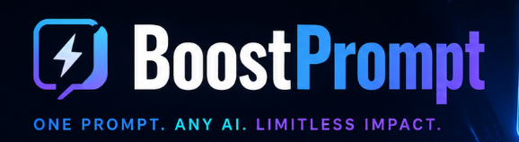

<p align="center">
  
</p>

<h1 align="center">BoostPrompt</h1>

<p align="center">
Discovery estruturado para transformar ideias e demandas em prompts prontos para implementação.
</p>

O **BoostPrompt** conduz o levantamento de requisitos com perguntas adaptativas,
alternativas, trade-offs e recomendações. Ao final, ele organiza as decisões em um
prompt Markdown único, autocontido, com requisitos, decisões, critérios de aceite e plano de execução.

## Landing page

O projeto inclui uma landing page estática e imersiva em `site/`, com narrativa de
scroll e uma cena 3D carregada apenas em dispositivos compatíveis. Para executá-la localmente:

```bash
cd site
npm install
npm run dev
```

Enquanto este repositório pertencer a `AirtonLira`, a publicação via GitHub Pages fica em
`https://airtonlira.github.io/boostprompt`.

Você pode usar o projeto de duas formas independentes:

- **CLI/TUI local**: uma aplicação interativa com sessões persistidas localmente em DuckDB;
- **Skills para Claude Code e Codex**: discovery conduzido diretamente na conversa do seu harness.

## O que o BoostPrompt oferece

- Entrevistas de discovery com **30 a 50 perguntas**, adaptadas às respostas anteriores;
- dois modos de saída: `prompt_desenvolvimento` e `roteiro_perguntas_cliente`;
- retomada de sessões e continuação de entrevistas concluídas;
- geração e persistência de prompts de implementação em Markdown;
- resumo estruturado para manter o contexto compacto em sessões longas;
- painel de qualidade com métricas locais de cobertura, clareza das decisões e prontidão do prompt;
- pesquisa técnica opcional via Exa, com fontes auditáveis;
- integração com endpoints compatíveis com a API da OpenAI, LiteLLM e OpenAI;
- skills instaláveis para Claude Code e Codex.

## Escolha o caminho certo

| Se você quer... | Use... |
| --- | --- |
| Sessões locais, retomada, resumo e arquivo `.md` persistido | [CLI/TUI local](#1-clitui-local) |
| Discovery dentro de uma conversa do Claude Code | [Skill para Claude Code](#usando-no-claude-code) |
| Discovery dentro de uma conversa do Codex | [Skill para Codex](#usando-no-codex) |
| Apenas uma lista de perguntas para enviar a um cliente | Modo `roteiro_perguntas_cliente` |

## Sumário

- [CLI/TUI local](#1-clitui-local)
  - [Pré-requisitos](#pré-requisitos)
  - [Instalação](#instalação)
  - [Configuração do modelo](#configuração-do-modelo)
  - [Iniciar a aplicação](#iniciar-a-aplicação)
  - [Fluxo de uma sessão](#fluxo-de-uma-sessão)
  - [Persistência e retomada](#persistência-e-retomada)
  - [Pesquisa técnica](#pesquisa-técnica)
- [Skills para Claude Code e Codex](#2-skills-para-claude-code-e-codex)
  - [Instalar as skills](#instalar-as-skills)
  - [Usando no Claude Code](#usando-no-claude-code)
  - [Usando no Codex](#usando-no-codex)
  - [Comportamento esperado](#comportamento-esperado)
- [Desenvolvimento](#desenvolvimento)
- [Estrutura do projeto](#estrutura-do-projeto)
- [Contribuição](#contribuição)
- [Licença](#licença)

## 1. CLI/TUI local

### Pré-requisitos

- Python 3.11 ou superior;
- [uv](https://docs.astral.sh/uv/);
- um endpoint compatível com a API da OpenAI e sua credencial, como LiteLLM,
  OpenRouter, vLLM ou a própria OpenAI.

### Instalação

Na raiz do repositório, instale as dependências:

```bash
uv sync --extra dev
```

Copie o arquivo de exemplo e configure as credenciais:

```bash
cp .env.example .env
```

O arquivo `.env` é carregado automaticamente, sem sobrescrever variáveis já
exportadas no shell. Ele não deve ser versionado.

### Configuração do modelo

Para usar LiteLLM, configure:

```dotenv
LLM_MODEL=gpt-4o-mini
LLM_BASE_URL=http://localhost:4000/v1
LLM_API_KEY=sua-chave-litellm
```

Também são aceitos os nomes legados `LITELLM_BASE_URL` e `API_KEY`.

Para usar a OpenAI diretamente, configure `OPENAI_API_KEY` e, opcionalmente,
`OPENAI_MODEL` e `OPENAI_BASE_URL`.

Variáveis úteis:

| Variável | Finalidade |
| --- | --- |
| `LLM_MODEL` | Modelo usado pelo endpoint compatível com OpenAI |
| `LLM_BASE_URL` | URL base do endpoint LiteLLM ou compatível |
| `LLM_API_KEY` | Credencial do endpoint configurado |
| `OPENAI_API_KEY` | Credencial para uso direto da OpenAI |
| `OPENAI_MODEL` | Modelo usado pela OpenAI diretamente |
| `OPENAI_BASE_URL` | URL alternativa para a API da OpenAI |
| `EXA_API_KEY` | Chave da Exa para a pesquisa técnica da CLI/TUI |
| `BOOSTPROMPT_ENV_FILE` | Caminho de um arquivo `.env` alternativo |
| `DUCKDB_PATH` | Caminho do banco local da aplicação |

### Iniciar a aplicação

```bash
uv run boostprompt
```

Ao iniciar, escolha **Usar LiteLLM** ou **Usar OpenAI**. Depois, use o menu para
criar uma sessão, listar sessões salvas ou retomar uma sessão pelo código
`BP-AAAA-NNN`.

### Fluxo de uma sessão

1. Escolha o provedor do modelo.
2. Escolha **Nova sessão**.
3. Informe um nome identificável.
4. Escolha o modo de saída.
5. Descreva a demanda inicial.
6. No modo `prompt_desenvolvimento`, responda uma pergunta por vez. A aplicação fará entre 30 e 50 perguntas adaptadas às respostas anteriores.
7. Depois de dez respostas, selecione **Gerar prompt agora** para salvar um rascunho sem encerrar a entrevista.
8. Ao final, selecione **Gerar/abrir Markdown** para visualizar e salvar o prompt mestre de implementação.

Cada interação é persistida automaticamente; não há botão de salvar.

#### Métricas e histórico

O painel de qualidade acompanha três métricas locais e determinísticas: cobertura do
contexto, clareza das decisões e prontidão do prompt. O histórico de sessões mostra
a última prontidão calculada e a data da atualização. O modo
`roteiro_perguntas_cliente` não recebe nota, pois não executa uma entrevista.

### Persistência e retomada

O banco padrão é `data/boostprompt.db`. Ele armazena:

- metadados da sessão e contadores de perguntas exibidas e respostas confirmadas;
- respostas do usuário e perguntas/respostas dos agentes;
- snapshots de contexto e decisões;
- referências de pesquisa;
- resumo estruturado do histórico antigo;
- Markdown final gerado.

Ao retomar uma sessão, a aplicação carrega as mensagens recentes e um resumo com
objetivo, fatos confirmados, decisões, restrições, riscos e pendências.

Ao abrir uma sessão concluída, a aplicação exibe o resumo e oferece **Continuar em
nova entrevista**. A continuação cria outra sessão com um novo código e usa apenas
o resumo estruturado da anterior, preservando o histórico original e mantendo o
contexto do modelo compacto.

O arquivo exportado fica em:

```text
output/<nome_da_sessão>_prompt_mestre.md
```

### Pesquisa técnica

Para pesquisas técnicas, a CLI/TUI usa a API da Exa quando `EXA_API_KEY` está
configurada. A pesquisa é planejada somente para decisões externas e mutáveis,
prioriza fontes oficiais ou primárias e preserva URL, data, trecho e decisão
fundamentada. Se a Exa estiver indisponível, a entrevista continua em modo
degradado sem inventar fontes.

## 2. Skills para Claude Code e Codex

As skills mantêm a mesma regra de discovery e os mesmos modos da CLI, mas funcionam
inteiramente na conversa do harness. Elas não usam o banco DuckDB da TUI nem
recuperam sessões locais: o histórico é o da própria conversa do Claude Code ou Codex.

### Instalar as skills

O instalador copia a skill correta e configura o MCP remoto `exa` para o harness
escolhido:

```bash
# Claude Code e Codex
uv run python install.py --harness both

# Somente Claude Code
uv run python install.py --harness claude

# Somente Codex
uv run python install.py --harness codex
```

O instalador exige somente o executável do harness no `PATH`.

Para instalar ou atualizar somente a skill, sem alterar a configuração MCP:

```bash
uv run python install.py --harness both --skip-mcp
```

Para conferir as ações sem modificar nada:

```bash
uv run python install.py --harness both --dry-run
```

Onde cada skill é instalada:

| Harness | Origem no repositório | Destino no usuário |
| --- | --- | --- |
| Claude Code | `.claude/skills/boostprompt/` | `~/.claude/skills/boostprompt/` |
| Codex | `.codex/skills/boostprompt/` | `~/.agents/skills/boostprompt/` |

O instalador preserva configurações existentes e, quando precisa criar o servidor,
registra `https://mcp.exa.ai/mcp` como MCP remoto. A autenticação remota segue a
configuração suportada pelo próprio Claude Code ou Codex; não inclua chaves em
arquivos versionados.

### Usando no Claude Code

Após instalar, abra o Claude Code no projeto ou em qualquer diretório e solicite a
skill com a demanda e o modo desejado:

```text
Use a skill boostprompt no modo prompt_desenvolvimento.
Quero definir o escopo de um portal de fornecedores.
```

Para gerar somente o roteiro de perguntas:

```text
Use a skill boostprompt no modo roteiro_perguntas_cliente.
Preciso de perguntas para entender uma integração de pagamentos.
```

O Claude Code usa o modelo e as credenciais já configurados no próprio harness.

### Usando no Codex

Após instalar, inicie uma conversa no Codex e solicite, por exemplo:

```text
Use a skill boostprompt no modo prompt_desenvolvimento.
Quero planejar uma plataforma de análise de dados.
```

Ou:

```text
Use a skill boostprompt no modo roteiro_perguntas_cliente.
Gere perguntas para levantar o escopo de um aplicativo de campo.
```

O Codex usa o modelo, a autenticação e as permissões configurados no próprio
harness. Quando o MCP `exa` estiver disponível, a skill usa `web_search_exa` e,
quando necessário, `web_fetch_exa` para decisões técnicas atuais; caso contrário,
continua em modo degradado.

### Comportamento esperado

- A skill pede ou reconhece `modo_saida`.
- Em `prompt_desenvolvimento`, não encerra antes de 30 respostas e encerra no máximo na pergunta 50.
- Cada pergunta apresenta contexto, alternativas, trade-offs, recomendação e forma de resposta.
- Em `roteiro_perguntas_cliente`, entrega diretamente um único Markdown com 30 a 50 perguntas, sem iniciar a entrevista interativa.
- Em `prompt_desenvolvimento`, a saída é um único `# Prompt Mestre de Implementação` autocontido, com decisões, plano de execução, critérios de aceite, validação, pendências e referências.

## Desenvolvimento

Instale as dependências de desenvolvimento:

```bash
uv sync --extra dev
```

Execute a suíte de testes e as verificações de qualidade:

```bash
uv run --extra dev pytest -q
uv run --extra dev pytest --cov=src/boostprompt --cov-report=term-missing -q
uv run --extra dev ruff check src tests
uv run --extra dev mypy src
```

Os testes evitam chamadas externas: agentes e MCP são substituídos por adaptadores
controlados, preservando a validação funcional de TUI, DuckDB, resumo, LangGraph,
pesquisa Exa degradada e exportação Markdown.

## Estrutura do projeto

```text
├── src/boostprompt/    # Aplicação CLI/TUI e componentes do discovery
├── skills/             # Skills distribuídas para os harnesses
├── tests/              # Testes automatizados
├── examples/           # Exemplos de uso e artefatos de referência
├── data/               # Banco local gerado durante a execução
├── output/             # Prompts Markdown exportados
├── install.py          # Instalador das skills e do MCP Exa
└── pyproject.toml      # Metadados, dependências e ferramentas do projeto
```

## Contribuição

Contribuições são bem-vindas. Antes de abrir um pull request:

1. crie uma branch para a alteração;
2. atualize a documentação quando mudar o comportamento do projeto;
3. execute os testes, o linter e o `mypy`;
4. descreva no pull request o problema resolvido e como a alteração foi validada.

Nunca inclua credenciais, arquivos `.env`, bancos DuckDB ou resultados gerados no
commit.

## Licença

Este projeto está disponível sob a [licença MIT](LICENSE).
