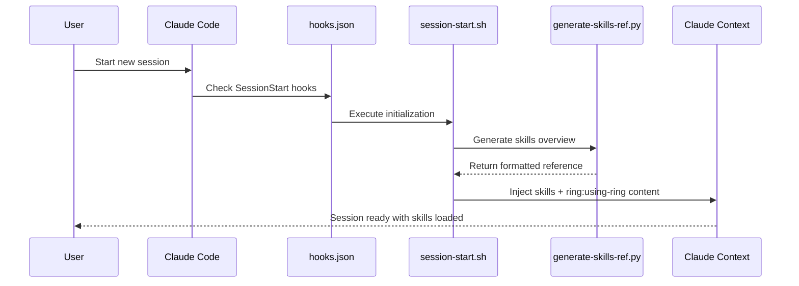
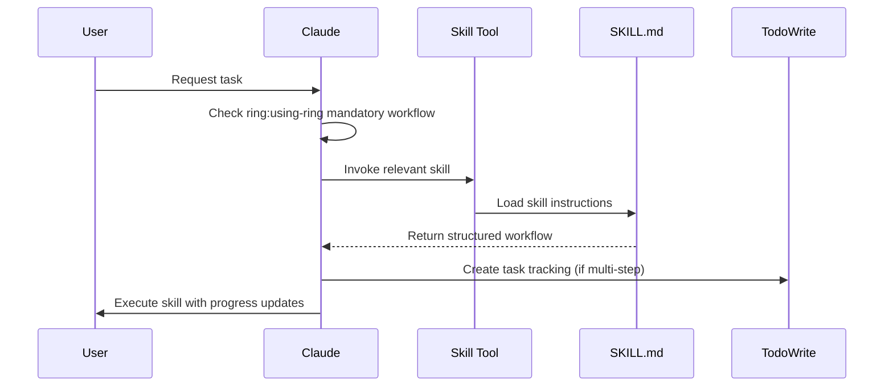

# Ring Architecture Documentation

## Table of Contents

1. [Overview](#overview)
2. [Marketplace Structure](#marketplace-structure)
3. [Component Hierarchy](#component-hierarchy)
4. [Core Components](#core-components)
5. [Data & Control Flow](#data--control-flow)
6. [Integration with Claude Code](#integration-with-claude-code)
7. [Execution Patterns](#execution-patterns)
8. [Component Relationships](#component-relationships)

## Overview

Ring is a **Claude Code plugin marketplace** that provides a comprehensive skills library and workflow system with **4 active plugins** (75 skills, 33 agents). It extends Claude Code's capabilities through structured, reusable patterns that enforce proven software engineering practices across the software delivery value chain: Product Planning → Development → Documentation.

Beyond Claude Code, each Ring plugin ships native install manifests for Codex (`<plugin>/.codex-plugin/`), Cursor (`<plugin>/.cursor-plugin/`), and OpenCode (`<plugin>/.opencode/`), plus a `ring-install.sh` symlink installer for local-dev workflows targeting Claude Code, Factory AI, OpenCode, and Codex.

### Architecture Philosophy

Ring operates on three core principles:

1. **Mandatory Workflows** - Critical skills (like ring:using-ring) enforce specific behaviors
2. **Parallel Execution** - Review systems run concurrently for speed
3. **Session Context** - Skills load automatically at session start
4. **Modular Plugins** - Specialized plugins for different domains and teams

### System Boundaries

```
┌─────────────────────────────────────────────────────────────────────────────────┐
│                              Claude Code                                         │
│  ┌───────────────────────────────────────────────────────────────────────────┐  │
│  │                          Ring Marketplace                                  │  │
│  │  ┌──────────────────────┐  ┌──────────────────────┐                       │  │
│  │  │ ring-default         │  │ ring-dev-team        │                       │  │
│  │  │ Skills(16) Agents(2) │  │ Skills(33) Agents(24)│                       │  │
│  │  │ Hooks/Lib            │  │                      │                       │  │
│  │  └──────────────────────┘  └──────────────────────┘                       │  │
│  │  ┌──────────────────────┐  ┌──────────────────────┐                       │  │
│  │  │ ring-pm-team         │  │ ring-tw-team         │                       │  │
│  │  │ Skills(14) Agents(4) │  │ Skills(4) Agents(3)  │                       │  │
│  │  └──────────────────────┘  └──────────────────────┘                       │  │
│  └───────────────────────────────────────────────────────────────────────────┘  │
│                                                                                  │
│  Native Tools: Skill, Task, TodoWrite                                           │
└─────────────────────────────────────────────────────────────────────────────────┘
```

> **Multi-harness install surface:** the diagram above shows Claude Code, the source-of-truth runtime. The same plugin tree is also installable in **Codex** (`<plugin>/.codex-plugin/plugin.json`), **Cursor** (`<plugin>/.cursor-plugin/plugin.json`), and **OpenCode** (`<plugin>/.opencode/plugins/ring-*.js` + `INSTALL.md`) via each harness's native package manager. For local-dev workflows, `ring-install.sh` symlinks the source tree into Claude Code, Factory AI, OpenCode, and Codex (with `.ring-build/` transformations for the latter two). See [README.md § Supported Platforms](README.md#-supported-platforms).

## Marketplace Structure

Ring is organized as a monorepo marketplace with multiple plugin collections:

```
ring/                                  # Monorepo root
├── .claude-plugin/
│   └── marketplace.json              # Multi-plugin registry (4 active plugins)
├── default/                          # Core plugin: ring-default
├── dev-team/                         # Developer agents: ring-dev-team
├── pm-team/                          # Product planning: ring-pm-team
└── tw-team/                          # Technical writing: ring-tw-team
```

### Active Plugins

_Versions managed in `.claude-plugin/marketplace.json`_

| Plugin               | Description                          | Components                       |
| -------------------- | ------------------------------------ | -------------------------------- |
| **ring-default**     | Core skills library                  | 22 skills, 2 agents               |
| **ring-dev-team**    | Developer agents                     | 35 skills, 24 agents              |
| **ring-pm-team**     | Product planning workflows           | 14 skills, 4 agents               |
| **ring-tw-team**     | Technical writing specialists        | 4 skills, 3 agents                |

## Component Hierarchy

### 1. Skills (`skills/`)

**Purpose:** Core instruction sets that define workflows and best practices

**Structure:**

```
skills/
├── {skill-name}/
│   └── SKILL.md           # Skill definition with frontmatter
├── shared-patterns/       # Reusable patterns across skills
│   ├── state-tracking.md
│   ├── failure-recovery.md
│   ├── exit-criteria.md
│   └── todowrite-integration.md
```

**Key Characteristics:**

- Self-contained directories with `SKILL.md` files
- YAML frontmatter: `name`, `description`
- Invoked via Claude's `Skill` tool
- Can reference shared patterns for common behaviors

### 2. Agents (`agents/`)

**Purpose:** Specialized agents that analyze code/designs or provide domain expertise using AI models

**Structure (ring-default plugin):**

```
default/agents/
├── review-slicer.md           # Thematic file grouping for large PRs (`ring:review-slicer`)
└── codebase-explorer.md       # Deep architecture analysis (`ring:codebase-explorer`)
```

**Structure (ring-dev-team plugin):**

```
dev-team/agents/
├── backend-go.md         # Go backend specialist (`ring:backend-go`)
├── backend-ts.md     # TypeScript backend specialist (`ring:backend-ts`)
├── devops.md                 # DevOps and infrastructure specialist (`ring:devops`)
├── bff-ts.md # BFF specialist (`ring:bff-ts`)
├── ui-designer.md               # Visual design specialist (`ring:ui-designer`)
├── frontend.md               # Frontend engineer (`ring:frontend`)
├── helm.md                   # Helm chart specialist (`ring:helm`)
├── code-reviewer.md                   # Foundation review (`ring:code-reviewer`)
├── logic-reviewer.md         # Correctness review (`ring:logic-reviewer`)
├── security-reviewer.md               # Safety review (`ring:security-reviewer`)
├── test-reviewer.md                   # Test coverage and quality review (`ring:test-reviewer`)
├── nil-reviewer.md             # Null/nil safety analysis (`ring:nil-reviewer`)
├── dead-code-reviewer.md              # Dead code analysis (`ring:dead-code-reviewer`)
├── commons-reviewer.md            # lib-commons usage review (`ring:commons-reviewer`)
├── obs-reviewer.md      # Conditional observability review (`ring:obs-reviewer`)
├── systemplane-reviewer.md        # Conditional runtime-config review (`ring:systemplane-reviewer`)
├── streaming-reviewer.md          # Conditional event producer review (`ring:streaming-reviewer`)
├── tenancy-reviewer.md           # Multi-tenant usage review (`ring:tenancy-reviewer`)
├── perf-reviewer.md              # Performance review (`ring:perf-reviewer`)
├── prompt-reviewer.md         # Prompt quality specialist (`ring:prompt-reviewer`)
├── qa.md                      # Backend QA specialist (`ring:qa`)
├── qa-frontend.md             # Frontend QA specialist (`ring:qa-frontend`)
├── sre.md                             # Observability and reliability specialist (`ring:sre`)
└── ui-engineer.md                     # UI component specialist (`ring:ui-engineer`)
```

**Key Characteristics:**

- Invoked via Claude's `Task` tool with `subagent_type`
- Invoked with specialized subagent_type for domain-specific analysis
- Review agents run in parallel (9 defaults plus triggered specialists dispatch simultaneously via `ring:reviewing-code` skill)
- Developer agents provide specialized domain expertise
- Return structured reports with severity-based findings

**Note:** Parallel review orchestration is handled by the `ring:reviewing-code` skill

**Standards Compliance Output (refactor-capable dev-team agents):**

Refactor-capable ring-dev-team agents produce a `## Standards Compliance` section in their output schema:

```yaml
- name: "Standards Compliance"
  pattern: "^## Standards Compliance"
  required: false # In schema, but MANDATORY when invoked from ring:planning-backend-refactor
  description: "MANDATORY when invoked from ring:planning-backend-refactor skill"
```

**Conditional Requirement: `invoked_from_dev_refactor`**

| Invocation Context            | Standards Compliance | Detection Mechanism                       |
| ----------------------------- | -------------------- | ----------------------------------------- |
| Direct agent call             | Optional             | N/A                                       |
| Via `ring:running-dev-cycle` skill    | Optional             | N/A                                       |
| Via `ring:planning-backend-refactor` skill | **MANDATORY**        | Prompt contains `**MODE: ANALYSIS ONLY**` |

**How Enforcement Works:**

```
┌─────────────────────────────────────────────────────────────────────┐
│  User invokes: ring:planning-backend-refactor                       │
│         ↓                                                           │
│  ring:planning-backend-refactor dispatches agents:                  │
│  "**MODE: ANALYSIS ONLY** - Compare codebase with Ring standards"   │
│         ↓                                                           │
│  Agent detects "**MODE: ANALYSIS ONLY**" in prompt                  │
│         ↓                                                           │
│  Agent loads Ring standards via WebFetch                            │
│         ↓                                                           │
│  Agent produces Standards Compliance output (MANDATORY)             │
└─────────────────────────────────────────────────────────────────────┘
```

**Affected Agents:**

- `ring:backend-go` → loads `golang.md`
- `ring:backend-ts` → loads `typescript.md`
- `ring:bff-ts` → loads `typescript.md`
- `ring:ui-designer` → loads `frontend.md`
- `ring:qa-frontend` → loads `frontend/testing-*.md` (accessibility/visual/e2e/performance)

**Output Format (when non-compliant):**

```markdown
## Standards Compliance

### Lerian/Ring Standards Comparison

| Category | Current Pattern | Expected Pattern | Status           | File/Location |
| -------- | --------------- | ---------------- | ---------------- | ------------- |
| Logging  | fmt.Println     | lib-observability/zap  | ⚠️ Non-Compliant | service/\*.go |

### Compliance Summary

- Total Violations: N
- Critical: N, High: N, Medium: N, Low: N

### Required Changes for Compliance

1. **Category Migration**
   - Replace: `current pattern`
   - With: `expected pattern`
   - Files affected: [list]
```

**Cross-References:**

- CLAUDE.md: Standards Compliance (Conditional Output Section)
- `dev-team/skills/planning-backend-refactor/SKILL.md`: HARD GATES defining requirement
- `dev-team/hooks/session-start.sh`: Injects guidance at session start

### 3. Hooks (`hooks/`)

**Purpose:** Session lifecycle management and automatic initialization

**Structure:**

```
default/hooks/
├── hooks.json              # Hook configuration (SessionStart)
├── session-start.sh        # Main initialization script
└── generate-skills-ref.py  # Dynamic skill reference generator
```

**Key Characteristics:**

- Triggers on SessionStart events (startup|resume, clear|compact)
- Injects skills context into Claude's memory
- Auto-generates skills quick reference from frontmatter
- Ensures mandatory workflows are loaded

### 4. Plugin Configuration (`.claude-plugin/`)

**Purpose:** Integration metadata for Claude Code marketplace

**Structure:**

```
.claude-plugin/
└── marketplace.json    # Multi-plugin registry
    ├── ring-default     # Core skills library
    ├── ring-dev-team    # Developer agents
    ├── ring-pm-team     # Product planning
    └── ring-tw-team     # Technical writing
```

**marketplace.json Schema:**

```json
{
  "name": "ring",
  "description": "...",
  "owner": { "name": "...", "email": "..." },
  "plugins": [
    {
      "name": "ring-default",
      "version": "...",
      "source": "./default",
      "keywords": ["skills", "tdd", "debugging", ...]
    },
    {
      "name": "ring-dev-team",
      "version": "...",
      "source": "./dev-team",
      "keywords": ["developer", "agents"]
    },
    {
      "name": "ring-pm-team",
      "version": "...",
      "source": "./pm-team",
      "keywords": ["product", "planning"]
    },
    {
      "name": "ring-tw-team",
      "version": "...",
      "source": "./tw-team",
      "keywords": ["technical-writing", "documentation"]
    }
  ]
}
```

### 5. Per-Harness Install Manifests

**Purpose:** Native install surface for non-Claude harnesses. Each Ring plugin ships its own per-harness manifest, so Codex, Cursor, and OpenCode install the plugin directly via their package managers — no transformation step, no central installer required.

**Structure (replicated under each of `default/`, `dev-team/`, `pm-team/`, `tw-team/`):**

```
<plugin>/
├── .codex-plugin/
│   └── plugin.json              # Codex manifest (name, version, skills/agents paths, interface)
├── .cursor-plugin/
│   └── plugin.json              # Cursor manifest (skills, agents, hooks paths)
└── .opencode/
    ├── INSTALL.md               # End-user install instructions for this plugin in OpenCode
    └── plugins/
        └── ring-<plugin>.js     # OpenCode runtime plugin (registers skills path; ring-default also injects using-ring bootstrap)
```

**Key Characteristics:**

- **Decentralized vs `.claude-plugin/`:** Claude Code uses one root-level marketplace.json that enumerates all 4 plugins. Codex/Cursor/OpenCode use per-plugin manifests so each plugin is independently installable.
- **OpenCode JS specifics:** `ring-default/.opencode/plugins/ring-default.js` is the only one that injects the `using-ring` bootstrap into the first user message of each session (mirrors Claude Code's session-start hook). The other three plugins' JS files only register their skills directory.
- **Versioning:** all per-harness manifests carry the same version as `marketplace.json` (kept in sync via `.github/workflows/version-bump.yml`).

**Local-dev alternative:** `ring-install.sh` at repo root provides symlink installs (per-file for Claude Code/Factory AI; transformed `.ring-build/` tree for Codex/OpenCode). Best for hot-reload local development against the source tree.

## Data & Control Flow

### Session Initialization Flow



### Skill Invocation Flow



### Parallel Review Flow

```mermaid
sequenceDiagram
    participant User
    participant Claude
    participant Task Tool
    participant ring:code-reviewer
    participant ring:logic-reviewer
    participant ring:security-reviewer
    participant ring:test-reviewer
    participant ring:nil-reviewer
    participant ring:dead-code-reviewer
    participant ring:perf-reviewer
    participant ring:tenancy-reviewer
    participant ring:commons-reviewer

    User->>Claude: Use ring:reviewing-code skill
    Note over Claude: Skill provides<br/>parallel review workflow

    Claude->>Task Tool: Dispatch 9 default parallel tasks

    par Parallel Execution
        Task Tool->>ring:code-reviewer: Review architecture
        and
        Task Tool->>ring:logic-reviewer: Review correctness
        and
        Task Tool->>ring:security-reviewer: Review vulnerabilities
        and
        Task Tool->>ring:test-reviewer: Review test coverage
        and
        Task Tool->>ring:nil-reviewer: Review nil safety
        and
        Task Tool->>ring:dead-code-reviewer: Review dead code
        and
        Task Tool->>ring:perf-reviewer: Review performance
        and
        Task Tool->>ring:tenancy-reviewer: Review multi-tenant usage
        and
        Task Tool->>ring:commons-reviewer: Review lib-commons usage
    end

    opt Conditional specialists triggered by changed stack
        Task Tool->>Task Tool: Dispatch obs/systemplane/streaming reviewers in same batch
    end

    ring:code-reviewer-->>Claude: Return findings
    ring:logic-reviewer-->>Claude: Return findings
    ring:security-reviewer-->>Claude: Return findings
    ring:test-reviewer-->>Claude: Return findings
    ring:nil-reviewer-->>Claude: Return findings
    ring:dead-code-reviewer-->>Claude: Return findings
    ring:perf-reviewer-->>Claude: Return findings
    ring:tenancy-reviewer-->>Claude: Return findings
    ring:commons-reviewer-->>Claude: Return findings

    Note over Claude: Aggregate & prioritize by severity
    Claude->>User: Consolidated report
```

## Integration with Claude Code

### Native Tool Integration

Ring leverages three primary Claude Code tools:

1. **Skill Tool**

   - Invokes skills by name: `skill: "ring:test-driven-development"`
   - Skills expand into full instructions within conversation
   - Skill content becomes part of Claude's working context

2. **Task Tool**

   - Dispatches agents to subagent instances: `Task(subagent_type="ring:code-reviewer")`
   - Enables parallel execution (multiple Tasks in one message)
   - Returns structured reports from independent analysis

3. **TodoWrite Tool**

   - Tracks multi-step workflows: `TodoWrite(todos=[...])`
   - Integrates with skills via shared patterns
   - Provides progress visibility to users

### Session Context Injection

At session start, Ring injects two critical pieces of context:

1. **Skills Quick Reference** - Auto-generated overview of all available skills
2. **ring:using-ring Skill** - Mandatory workflow that enforces skill checking

This context becomes part of Claude's memory for the entire session, ensuring:

- Claude knows which skills are available
- Mandatory workflows are enforced
- Skills are checked before any task

## Execution Patterns

### Pattern 1: Mandatory Skill Checking

```
User Request → ring:using-ring check → Relevant skill?
    ├─ Yes → Invoke skill → Follow workflow
    └─ No → Proceed with task
```

**Implementation:** The ring:using-ring skill is loaded at session start and contains strict instructions to check for relevant skills before ANY task.

### Pattern 2: Parallel Review Execution

```
Review Request → ring:reviewing-code skill → ring:review-slicer (classify)
    ├─ Small/focused PR → 9 default Tasks in parallel (full diff)
    └─ Large/multi-theme PR → For EACH slice:
        ├─ ring:code-reviewer            ─┐
        ├─ ring:logic-reviewer   │
        ├─ ring:security-reviewer         │
        ├─ ring:test-reviewer             │
        ├─ ring:nil-reviewer       │
        ├─ ring:dead-code-reviewer        ┼─→ Merge + dedup → Handle by severity
        ├─ ring:perf-reviewer      │
        ├─ ring:tenancy-reviewer     │
        └─ ring:commons-reviewer     ─┘

        Conditional specialists join the same batch only when triggered:
        ring:obs-reviewer, ring:systemplane-reviewer,
        ring:streaming-reviewer
```

**Implementation:** The `ring:review-slicer` agent classifies files into thematic slices for large PRs (15+ files). For each slice, the diagrammed 9 default reviewers always dispatch in parallel via a single message. Conditional specialists (`ring:obs-reviewer`, `ring:systemplane-reviewer`, `ring:streaming-reviewer`) join that same batch only when their triggers match. Results are merged and deduplicated before consolidation. Small PRs skip slicing entirely (zero overhead).

### Pattern 3: Progressive Skill Execution

```
Complex Skill → TodoWrite tracking
    ├─ Phase 1: Understanding     [in_progress]
    ├─ Phase 2: Exploration       [pending]
    ├─ Phase 3: Design           [pending]
    └─ Phase 4: Documentation    [pending]
```

**Implementation:** Multi-phase skills use TodoWrite to track progress through structured workflows.

### Pattern 4: Rolling-Wave Planning Hierarchy (pm-team → dev-team)

```
ring:planning-* (pm-team) → ring:writing-plans (default)
    └─ plan.md — phased plan, living document
       (Phase Overview + epics `Epic N.M` + Phase 1 tasks `Task N.M.T`)
            ↓
ring:running-dev-cycle / ring:running-dev-cycle-frontend (dev-team)
    ├─ Gate 0 per task          (TDD implementation)
    ├─ Gate 8/9 per epic        (review + validation; frontend: Gate 7 per epic, Gate 8 per task)
    └─ Phase boundary per phase (Step 11.5):
        close phase → record deviations → user checkpoint →
        elaborate next phase's epics into dispatch-ready tasks
        against the codebase as it now exists
```

**Implementation:** Only the active phase is task-detailed; later phases stay at epic level and are elaborated at each phase boundary (rolling wave — pre-written detail for a not-yet-built phase is stale by construction). `plan.md` is the single living source of truth: dev-cycle orchestrators and `ring:executing-plans` (default plugin) write elaborated tasks back into it. Dev-cycle state persists with schema v2.0.0 (phases → epics → tasks). See `dev-team/skills/running-dev-cycle/gates/phase-boundary.md` and `dev-team/skills/shared-patterns/gate-cadence-classification.md`.

## Component Relationships

### Skills ↔ Agents

**Difference:**

- **Skills:** Instructions executed by current Claude instance
- **Agents:** Specialized reviewers executed by separate Claude instances

**Interaction:**

- Skills can invoke agents (e.g., ring:reviewing-code skill dispatches review agents)
- Agents don't typically invoke skills (they're independent analyzers)

### Skills ↔ Shared Patterns

**Relationship:** Inheritance/composition

- Skills reference shared patterns for common behaviors
- Patterns provide reusable workflows (state tracking, failure recovery)

**Example:**

```markdown
# In a skill:

See `skills/shared-patterns/todowrite-integration.md` for tracking setup
```

### Hooks ↔ Skills

**Relationship:** Initialization and context loading

- Hooks load skill metadata at session start
- generate-skills-ref.py scans all SKILL.md frontmatter
- session-start.sh injects ring:using-ring skill content

**Data Flow:**

```
SKILL.md frontmatter → generate-skills-ref.py → formatted overview → session context
```

### Agents ↔ Orchestrator

**Relationship:** Agent dispatch via Task tool

- Agents are invoked via `Task(subagent_type: "ring:{agent-name}")`
- Review agents run in parallel for comprehensive analysis
- Agent specialization determines depth and quality of analysis

### TodoWrite ↔ Skills

**Relationship:** Progress tracking integration

- Multi-step skills create TodoWrite items
- Each phase updates todo status (pending → in_progress → completed)
- Provides user visibility into workflow progress

## Key Architectural Decisions

### 1. Parallel vs Sequential Reviews

**Decision:** Reviews run in parallel, not sequentially
**Rationale:** 3x faster feedback, comprehensive coverage, easier prioritization
**Implementation:** Single message with multiple Task calls

### 2. Session Context Injection

**Decision:** Load all skills metadata at session start
**Rationale:** Ensures Claude always knows available capabilities
**Trade-off:** Larger initial context vs. consistent skill awareness

### 3. Mandatory Workflows

**Decision:** Some skills (ring:using-ring) are non-negotiable
**Rationale:** Prevents common failures, enforces best practices
**Enforcement:** Loaded automatically, contains strict instructions

### 4. Skill vs Agent Separation

**Decision:** Skills for workflows, agents for analysis
**Rationale:** Different execution models (local vs. subagent)
**Benefit:** Clear separation of concerns

### 5. Frontmatter-Driven Discovery

**Decision:** All metadata in YAML frontmatter
**Rationale:** Single source of truth, easy parsing, consistent structure
**Usage:** Auto-generation of documentation, skill matching

## Extension Points

### Adding New Skills

1. Create `skills/{name}/SKILL.md` with frontmatter
2. Skills auto-discovered by generate-skills-ref.py
3. Available immediately after session restart

### Adding New Agents

1. Create `{plugin}/agents/{name}.md` with agent definition
2. Include YAML frontmatter: `name`, `description`, `version`
3. Invoke via Task tool with `subagent_type="ring:{name}"`
4. Review agents can run in parallel via `ring:reviewing-code` skill
5. Developer agents provide domain expertise via direct Task invocation

### Adding Shared Patterns

1. Create `skills/shared-patterns/{pattern}.md`
2. Reference from skills that need the pattern
3. Maintains consistency across skills

### Adding New Plugins

1. Create plugin directory: `mkdir -p {plugin-name}/{skills,agents,hooks,lib}`
2. Register in `.claude-plugin/marketplace.json`:
   ```json
   {
     "name": "ring-{plugin-name}",
     "version": "0.1.0",
     "source": "./{plugin-name}",
     "keywords": [...]
   }
   ```
   (Note: Initial version is 0.1.0, then managed via version bumps)
3. Create `{plugin-name}/hooks/hooks.json` for initialization
4. Add skills/agents following same structure as `default/`

## Performance Considerations

### Parallel Execution Benefits

- **3x faster reviews** - All reviewers run simultaneously
- **No blocking** - Independent agents don't wait for each other
- **Better resource utilization** - Multiple Claude instances work concurrently

### Context Management

- **Session start overhead** - One-time loading of skills context
- **Skill invocation** - Skills expand inline, no additional calls
- **Agent invocation** - Separate instances, clean context per agent

### Optimization Strategies

1. **Selective agent usage** - Only invoke relevant reviewers
2. **Skill caching** - Skills loaded once per session
3. **Parallel by default** - Never chain reviewers sequentially
4. **Early validation** - Preflight checks prevent wasted work

## Common Patterns and Anti-Patterns

### Patterns to Follow

✅ Check for relevant skills before any task
✅ Run reviewers in parallel for speed
✅ Use TodoWrite for multi-step workflows
✅ Reference shared patterns for consistency
✅ Specify models explicitly for agents

### Anti-Patterns to Avoid

❌ Skipping skill checks (violates ring:using-ring)
❌ Running reviewers sequentially (3x slower)
❌ Implementing without tests (violates TDD)
❌ Claiming completion without verification
❌ Hardcoding workflows instead of using skills

## Troubleshooting Guide

### Skills Not Loading

1. Check hooks/hooks.json configuration
2. Verify session-start.sh is executable
3. Ensure SKILL.md has valid frontmatter

### Parallel Reviews Not Working

1. Ensure all Task calls in single message
2. Verify agent names match exactly
3. Check agent names match exactly

### Context Overflow

1. Consider selective skill loading
2. Use focused agent invocations
3. Clear completed todos regularly

## Summary

Ring's architecture is designed for:

- **Modularity** - Independent, composable components across multiple plugins
- **Performance** - Parallel execution wherever possible (3x faster reviews)
- **Reliability** - Mandatory workflows prevent failures
- **Extensibility** - Easy to add new skills/agents/plugins
- **Scalability** - Marketplace structure supports product and team-specific plugins
- **Integration** - Seamless with Claude Code's native tools

### Current State

_Component counts reflect current state; plugin versions managed in `.claude-plugin/marketplace.json`_

| Component                 | Count      | Location               |
| ------------------------- | ---------- | ---------------------- |
| Active Plugins            | 4          | All plugin directories |
| Skills (ring-default)     | 16         | `default/skills/`      |
| Skills (ring-dev-team)    | 33         | `dev-team/skills/`     |
| Skills (ring-pm-team)     | 14         | `pm-team/skills/`      |
| Skills (ring-tw-team)     | 4          | `tw-team/skills/`      |
| **Total Skills**          | **67**     | **All plugins**        |
| Agents (ring-default)     | 2          | `default/agents/`      |
| Agents (ring-dev-team)    | 24         | `dev-team/agents/`     |
| Agents (ring-pm-team)     | 4          | `pm-team/agents/`      |
| Agents (ring-tw-team)     | 3          | `tw-team/agents/`      |
| **Total Agents**          | **33**     | **All plugins**        |
| Hooks                     | Per plugin | `{plugin}/hooks/`      |

The system achieves these goals through clear component separation, structured workflows, automatic context management, and a modular marketplace architecture, creating a robust foundation for AI-assisted software development.
